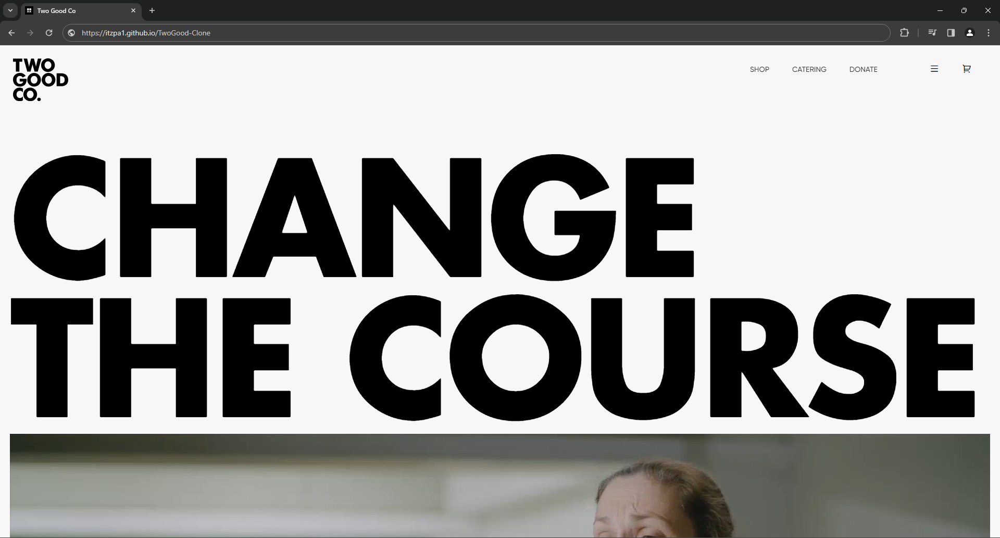

# Two Good Co Clone ⚡️ 
> A clean, beautiful, animated responsive clone!

> https://itzpa1.github.io/TwoGood-Clone/

### Website Preview

 
  <kbd>
    
  </kbd>

:star: Star me on GitHub — it helps!

## Features 📋
⚡️ Fully Responsive\
⚡️ Valid HTML5 & CSS3\
⚡️ Animation\
⚡️ Easy to modify

## Installation & Deployment 📦
- Clone the repository and modify the content of <b>index.html</b> according to your requirement.
- Add or remove images from `itzpa1.github.io/images/` directory as per your requirement.
- To deploy your website, first you need to create github repository with name `<your-github-username>.github.io`. Please don't give any other name.
- Push the generated code to the `master` branch of this repository.
- <b>NOTE:</b> Make sure to set `analyticsId` from your Google Analytics account inside the Google Analytics script tag, if you want to use your own Google Analytics account.

## Sections 📚
✔️ Shop\
✔️ Catering\
✔️ Donate\

To view a live example, **[click here](https://itzpa1.github.io/TwoGood-Clone/)**

## Contributing 💡
#### Step 1

- **Option 1**
    - 🍴 Fork this repo!

- **Option 2**
    - 👯 Clone this repo to your local machine.

#### Step 2

- **Build your code** 🔨🔨🔨

#### Step 3

- 🔃 Create a new pull request.

## License 📄
This project is licensed under the MIT License - see the [LICENSE.md](./LICENSE) file for details.
